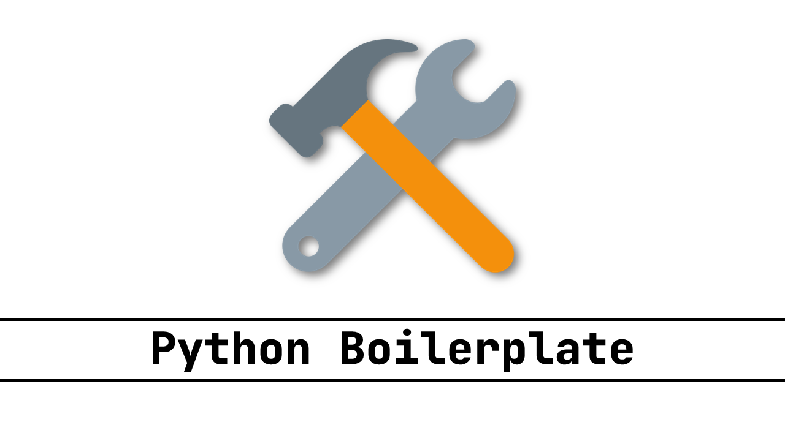

[](https://github.com/johnnymillergh/python_boilerplate/releases)
[](https://github.com/johnnymillergh/python_boilerplate/actions)
[](https://github.com/johnnymillergh/python_boilerplate/issues)
[](https://github.com/johnnymillergh/python_boilerplate/network)
[](https://github.com/johnnymillergh/python_boilerplate)
[](https://github.com/johnnymillergh/python_boilerplate/blob/master/LICENSE)
[](https://github.com/johnnymillergh/python_boilerplate)
[](https://github.com/johnnymillergh/python_boilerplate)
[](https://twitter.com/intent/tweet?text=Wow:&url=https%3A%2F%2Fgithub.com%2Fjohnnymillergh%2Fpython_boilerplate)

# Python Boilerplate

**python_boilerplate** is a boilerplate project for Python. Based on template [sourcery-ai/python-best-practices-cookiecutter](https://github.com/sourcery-ai/python-best-practices-cookiecutter).

[Official Docker Image](https://github.com/johnnymillergh/python_boilerplate/pkgs/container/python_boilerplate%2Fpython_boilerplate)

## Features

Here are the highlights of **python_boilerplate**:

1. Inherited from modern and the latest Python technologies:

   `Python` - [](https://www.python.org/downloads/release/python-3120/)

   `Poetry` is to Python virtualenv management tool for the project.

2. Data validation using Python type hints with [Pydantic](https://github.com/pydantic/pydantic).

3. Highly customizable data analysis with [pandas](https://pandas.pydata.org/), enhanced array operation with [NumPy](https://numpy.org/). Supports CSV, Excel, JSON, and so on.

4. Data persistence with [peewee](http://docs.peewee-orm.com/en/latest/), [SQLite3](https://sqlite.org/index.html) as a local database.

5. Simple and flexible retry with [Tenacity](https://github.com/jd/tenacity).

6. Environment variable and configuration with [pyhocon](https://pythonhosted.org/pyhocon/_modules/pyhocon.html). Read `${ENVIRONMENT_VARIABLE}` when startup.

7. Sensible and human-friendly approach to creating, manipulating, formatting and converting dates, times, and timestamps with [Arrow](https://pypi.org/project/arrow/).

8. Generate fake data with [Faker](https://pypi.org/project/Faker/).

9. Customized function decorator `@async_function` to enable function to run asynchronously; `@peewee_table` class decorator to register ORM tables; `@elapsed_time(level="INFO")` to profile a function elapsed time.

10. Testing with [pytest](https://docs.pytest.org/en/latest/), integrating [pytest-mock](https://pypi.org/project/pytest-mock/) for mocking, [pytest-cov](https://pypi.org/project/pytest-cov/) for code coverage analysis and [pyinstrument](https://github.com/joerick/pyinstrument) for Python stack profiler.

11. Formatting with [black](https://github.com/psf/black).

12. Import sorting with [isort](https://github.com/timothycrosley/isort).

13. Static typing with [mypy](http://mypy-lang.org/).

14. Linting with [flake8](http://flake8.pycqa.org/en/latest/).

15. Git hooks that run all the above with [pre-commit](https://pre-commit.com/).

16. Deployment ready with [Docker](https://docker.com/).

17. Continuous Integration with [GitHub Actions](https://github.com/features/actions).

18. Loguru logging configuration. The log sample,

   ```
   2022-09-17 14:13:52.385 | ⚠️ WARNING  | 6860 | MainThread      | python_boilerplate.repository.model.base_model.<module>:24 - SQLite database created. Path: [/Users/johnny/Projects/PyCharmProjects/python_boilerplate/data/python_boilerplate.db], <peewee.SqliteDatabase object at 0x1191e1390>
   2022-09-17 14:13:52.386 | ℹ️ INFO     | 6860 | MainThread      | python_boilerplate.common.orm.peewee_table:16 - Registering peewee table: StartupLog
   2022-09-17 14:13:52.387 | 🐞 DEBUG    | 6860 | MainThread      | peewee.execute_sql:3185 - ('CREATE TABLE IF NOT EXISTS "startup_log" ("id" INTEGER NOT NULL PRIMARY KEY, "current_user" VARCHAR(50) NOT NULL, "host" VARCHAR(50) NOT NULL, "command_line" TEXT NOT NULL, "current_working_directory" TEXT NOT NULL, "startup_time" DATETIME NOT NULL, "created_by" VARCHAR(50) NOT NULL, "created_time" DATETIME NOT NULL, "modified_by" VARCHAR(50) NOT NULL, "modified_time" DATETIME NOT NULL)', [])
   2022-09-17 14:13:52.530 | ℹ️ INFO     | 6860 | MainThread      | python_boilerplate.<module>:53 - Started python_boilerplate in 0.117 seconds (117.26 ms)
   ```

## Usage

1. Clone or download this project.

   ```shell
   $ git clone https://github.com/johnnymillergh/python_boilerplater.git
   ```

2. Build with the newest PyCharm.

3. Click the green triangle to Run.

## Setup

1. Setup the development environment

   ```shell
   # Install pipx if not installed
   $ python3 -m pip install pipx
   $ python3 -m pipx ensurepath

   # Install poetry using pipx, https://python-poetry.org/docs/#installing-with-pipx
   $ pipx install poetry
   ```

2. Install dependencies, with optional dependency group `test`

   ```shell
   $ poetry install --with test
   ```

3. Install mypy types

   ```shell
   $ poetry run mypy --install-types
   ```

4. Setup pre-commit and pre-push hooks

   ```shell
   $ poetry run pre-commit install -t pre-commit
   $ poetry run pre-commit install -t pre-push
   ```

## Useful Commands

### Run Python Module

```shell
$ python3 -m python_boilerplate
```

### Run Python Script

**Append your project’s root directory to** `PYTHONPATH` — In any environment you wish to run your Python application such as Docker, vagrant or your virtual environment i.e. in bin/activate, run the below command:

> [How to Fix ModuleNotFoundError and ImportError](https://towardsdatascience.com/how-to-fix-modulenotfounderror-and-importerror-248ce5b69b1c)

For macOS or Linux,

```shell
# Ensure `pwd` is the root directory of the project
$ PYTHONPATH=`pwd` poetry run python3 python_boilerplate/demo/pandas_usage.py
$ PYTHONPATH=`pwd` poetry run python3 python_boilerplate/demo/multithread_and_thread_pool_usage.py

# Run the main module
$ PYTHONPATH=`pwd` poetry run python3 python_boilerplate/__main__.py

# Run a pytest script
$ pytest --log-cli-level=DEBUG --capture=no tests/common/test_debounce_throttle.py

# Run a pytest script with `-k` EXPRESSION
$ pytest --log-cli-level=DEBUG --capture=no tests/common/test_debounce_throttle.py -k 'test_debounce'

# For more details of pytest command
$ poetry run pytest --help
```

For Windows Terminal,
```powershell
# Ensure `$PWD.Path` is the root directory of the project
$ $env:PYTHONPATH=$PWD.Path; poetry run python .\python_boilerplate\demo\pandas_usage.py
$ $env:PYTHONPATH=$PWD.Path; poetry run python .\python_boilerplate\demo\multithread_and_thread_pool_usage.py

# Run the main module
$ $env:PYTHONPATH=$PWD.Path; poetry run python .\python_boilerplate\__main__.py
```

### Package with [PyInstaller](https://pyinstaller.org/en/latest/usage.html?highlight=pythonpath#using-pyinstaller)

> **⚠️ WANRING**
>
> Need to call `freeze_support()` immediately when startup in `python_boilerplate/__init__.py`
>
> ```python
> from multiprocessing import freeze_support
>
> freeze_support()
> ```
>
> - [Pyinstaller multiprocessing name of process is always "MainProcess" #3957](https://github.com/pyinstaller/pyinstaller/issues/3957#issuecomment-674579877)
> - [pyinstaller linux binary is getting restarted again and again #4190](https://github.com/pyinstaller/pyinstaller/issues/4190)

Build artifact with macOS or Linux,
```shell
$ poetry run pyinstaller --console \
--add-data "pyproject.toml:." \
--add-data "src/python_boilerplate/resources/*:python_boilerplate/resources" \
--name pandas_usage \
--clean --noconfirm src/python_boilerplate/demo/pandas_usage.py
```

On Windows,
```powershell
$ poetry run pyinstaller --console `
--add-data "pyproject.toml;." `
--add-data "src/python_boilerplate/resources/*;python_boilerplate/resources" `
--name multithread_and_thread_pool_usage `
--clean --noconfirm src/python_boilerplate/demo/multithread_and_thread_pool_usage.py
```

### Run Unit Tests

Run with pytest, analyze code coverage, generate HTML code coverage reports, fail the test if coverage percentage is under 90%,

```shell
$ poetry run pytest --cov --cov-report html --cov-fail-under=85 --capture=no --log-cli-level=INFO
```

Benchmark with pytest,

```shell
$ poetry run pytest --capture=no --log-cli-level=ERROR -n 0 --benchmark-only
```

### Conventional Changelog CLI

1. Install global dependencies (optional if installed):

   ```shell
   $ npm install -g conventional-changelog-cli
   ```

2. This will *not* overwrite any previous changelogs. The above generates a changelog based on commits since the last semver tag that matches the pattern of "Feature", "Fix", "Performance Improvement" or "Breaking Changes".

   ```shell
   $ conventional-changelog -p angular -i CHANGELOG.md -s
   ```

3. If this is your first time using this tool and you want to generate all previous changelogs, you could do:

   ```shell
   $ conventional-changelog -p angular -i CHANGELOG.md -s -r 0
   ```

### Check Versions of Python Packages

```shell
$ poetry run pip list --outdated
```

Output be like,

```
Package          Version   Latest     Type
---------------- --------- ---------- -----
black            23.10.1   23.11.0    wheel
certifi          2023.7.22 2023.11.17 wheel
Faker            19.12.0   20.1.0     wheel
identify         2.5.31    2.5.32     wheel
idna             3.4       3.6        wheel
matplotlib       3.8.0     3.8.2      wheel
mypy             1.6.1     1.7.1      wheel
numpy            1.26.1    1.26.2     wheel
pandas           2.1.2     2.1.3      wheel
pip              23.1.2    23.3.1     wheel
platformdirs     3.11.0    4.0.0      wheel
pydantic         2.4.2     2.5.2      wheel
pydantic_core    2.10.1    2.14.5     wheel
pyinstaller      6.1.0     6.2.0      wheel
pyinstrument     4.6.0     4.6.1      wheel
pytest-html      4.0.2     4.1.1      wheel
pytest-xdist     3.3.1     3.5.0      wheel
setuptools       68.2.2    69.0.2     wheel
types-setuptools 68.2.0.0  69.0.0.0   wheel
urllib3          2.0.7     2.1.0      wheel
virtualenv       20.24.6   20.24.7    wheel
wheel            0.41.3    0.42.0     wheel
```

## CI (Continuous Integration)

- GitHub Actions are for building projects and running tests.
- ~~[Travis CI](https://travis-ci.com/github/johnnymillergh/) is for publishing Docker Hub images of SNAPSHOT and RELEASE.~~

## FAQ

1. [ExecutableNotFoundError: Executable `/bin/bash` not found when using pre-commit](https://stackoverflow.com/questions/72321412/bin-bash-not-found-when-using-pre-commit)

   **Solution**: delete `.git/hooks/pre-commit.legacy` and then reinstall, also deleted `.git/hooks/pre-commit` just to be sure before installing again.

2. Installing all stub type packages,

   ```shell
   $ mypy --install-types
   ```

## Maintainers

[@johnnymillergh](https://github.com/johnnymillergh).

## Contributing

Feel free to dive in! [Open an issue](https://github.com/johnnymillergh/python_boilerplate/issues/new).

### Contributors

This project exists thanks to all the people who contribute.

- Johnny Miller [[@johnnymillergh](https://github.com/johnnymillergh)]
- …


### Sponsors

Support this project by becoming a sponsor. Your logo will show up here with a link to your website. [[Become a sponsor](https://become-a-sponsor.org)]

## Credits

This package was created with Cookiecutter and the [sourcery-ai/python-best-practices-cookiecutter](https://github.com/sourcery-ai/python-best-practices-cookiecutter) project template.

Inspired by [How to set up a perfect Python project](https://sourcery.ai/blog/python-best-practices/).

## License

[Apache License](https://github.com/johnnymillergh/python_boilerplate/blob/main/LICENSE) © Johnny Miller

2021—Present
